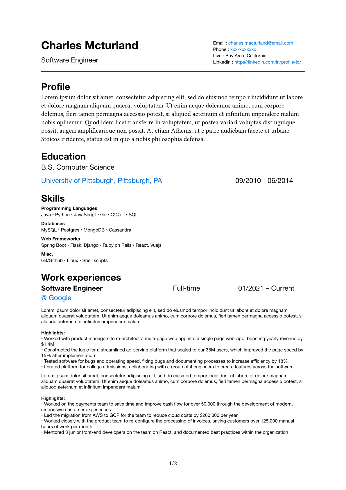
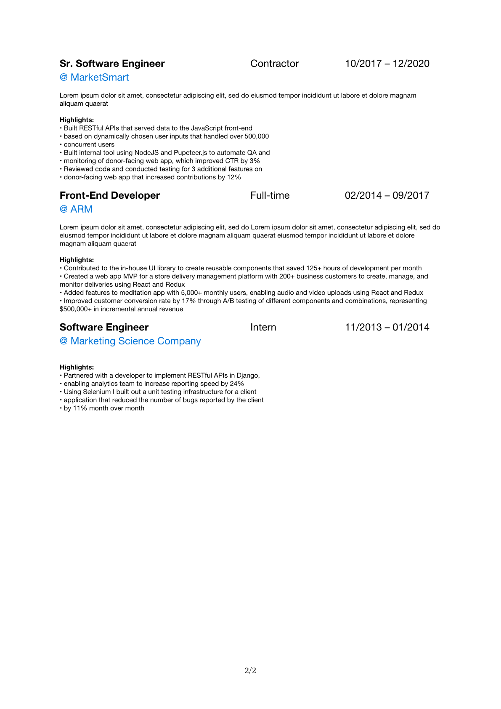

## Typst template for resume 

[Typst](https://github.com/typst/typst?tab=readme-ov-file#example) is as
easy to use as Markdown and as powerful as LaTeX.

Built it with [Bare-bones Typst CV](https://github.com/caffeinatedgaze/bare-bones-cv)
as a baseline and edited heavily to fit my needs.

This template was designed for multiple pages.

*Example*

|                        |                        |
| ---------------------- | ---------------------- |
| | |

Just edit the file `content.yaml` with your own info, skills, education, 
work experieces if the format is good to you. Then

## Install typst

On macOS:
`$brew install typst`

Check out [Installation](https://github.com/typst/typst?tab=readme-ov-file#installation)
for other OS


## Usage

```shell
$typst compile resume.typ --open
```
it will generate resume.pdf and open it using default pdf viewer in your system

Watch source files and recompiles on changes.
`$typst watch -f pdf resume.typ --open`


